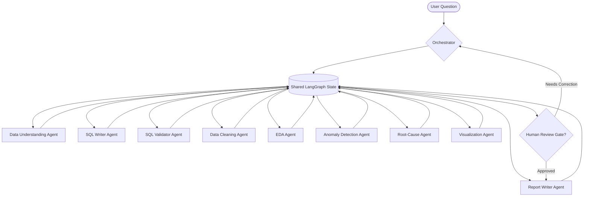

# Session 8: System Design — Architecture Before Code

Welcome to Phase 3: Building the System! 

Before we write a single line of agent orchestration logic, we must design the architecture. Teams that skip this step end up with "spaghetti agents" that share no common state, duplicate work, and cannot communicate. This session is dedicated to designing the data contracts, shared state, and orchestration workflow.

---

## 1. Session Objectives
1. **Review Session 7 Homework:** Evaluate graph diagrams and routing decisions.
2. **Define Agent Responsibilities:** Align on what each of the 10 agents reads and writes.
3. **Design the Shared State:** Establish the exact schema and data types stored in LangGraph.
4. **Data Contracts:** Set the output formats (JSON/Pydantic schemas) for agent transitions.
5. **Team Alignment:** Divide ownership of agents and set up a branching strategy.

---

## 2. Multi-Agent System Architecture

Our system is modeled as a collaborative team of digital manufacturing investigators. The interaction is choreographed by an **Orchestrator Agent** writing to a shared **State**.



---

## 3. Self-Documenting Data & Sensor Limits

To help students build robust, rule-based reasoning engines and allow agents to quickly inspect process limits, we have implemented a self-documenting data architecture:

### 3.1 Centralized Sensor Limits (`sensor_limits.json`)
Located at [generator/sensor_limits.json](file:///Users/lucian/Projects/savnet/savnet-python-ai/M3&4/Session8-System-Design/generator/sensor_limits.json), this JSON file serves as the single source of truth for process parameters. It defines three operational zones for each sensor:
*   `normal`: Process is running stably in control.
*   `warning`: Process is starting to drift (warning signs).
*   `critical`: High risk of immediate defect generation or process failure.

Each sensor is fully documented with a `"brief"` (short name) and `"description"` (underlying physics, manufacturing risk, and stakeholders).

### 3.2 Reading Limits in Python (Deterministic Rule Engine)
Students can implement python function tools for their agents to load these limits directly:
```python
import json

def check_sensor_drift(station_id: str, sensor_name: str, value: float) -> str:
    with open("generator/sensor_limits.json", "r") as f:
        limits = json.load(f)[station_id]["sensors"][sensor_name]["limits"]
    
    # Simple threshold checks
    normal_low, normal_high = limits["normal"]
    warn_low, warn_high = limits["warning"]
    
    if normal_low <= value <= normal_high:
        return "NORMAL"
    elif warn_low <= value <= warn_high:
        return "WARNING"
    else:
        return "CRITICAL"
```

### 3.3 Embedded Parquet Metadata
All generated Parquet files have these specifications compiled directly into their schema headers. Agents can inspect the table description and column limits directly from the binary metadata without loading external database tables:

```python
import pyarrow.parquet as pq

schema = pq.read_schema("data/foaming_telemetry.parquet")

# Retrieve table-level description
print(schema.metadata[b'table_description'].decode())

# Retrieve limits for a specific field
iso_field = schema.field(schema.get_field_index("iso_temp"))
print(iso_field.metadata[b'limits_normal'].decode())  # e.g., "[22.0, 25.0]"
print(iso_field.metadata[b'description'].decode())    # Detailed manufacturing context
```

---

## 4. The Shared State Schema (`AgentState`)

All agents communicate by modifying a shared state object in LangGraph. Below is the reference Python schema using `TypedDict`. This must be imported by all agent modules:

```python
from typing import TypedDict, List, Dict, Any, Optional

class AgentState(TypedDict):
    # Inputs & Setup
    user_question: str                  # Original question from the user
    raw_data_paths: Dict[str, str]       # Paths to the raw Parquet tables
    cleaned_data_paths: Dict[str, str]   # Paths to cleaned Parquet tables
    
    # Query & Execution
    sql_query: Optional[str]             # Current generated SQL query
    sql_result_summary: Optional[str]    # Plain-text statistical summary of SQL query results
    sql_error: Optional[str]             # Error messages from parser or database execution
    
    # Diagnostic Findings
    data_profile: Optional[Dict[str, Any]] # Key statistics and quality flags of the dataset
    eda_findings: Optional[List[str]]      # General trend patterns identified in the data
    detected_anomalies: Optional[List[Dict[str, Any]]] # Anomalies found (station, part_id, metric, deviation)
    root_cause_hypotheses: Optional[List[Dict[str, Any]]] # Correlated failure modes (cause, evidence, confidence)
    
    # Deliverables
    report_markdown: Optional[str]       # The final markdown business report
    chart_specs: Optional[List[Dict[str, Any]]] # Plotly or Seaborn configurations for visualization
    
    # Control Flow
    next_step: str                       # The next node to execute
    execution_history: List[str]         # Ordered trace of nodes executed
    confidence_score: float              # System confidence level (0.0 to 1.0)
    human_approved: bool                 # Flag set by human-in-the-loop validation
    feedback_notes: Optional[str]        # Manual feedback comments from human reviewer
```

---

## 4. Individual Agent Definitions & Data Contracts

### 1. Data Understanding Agent
*   **Role:** Inspects schemas, data types, null counts, and column distribution boundaries.
*   **Reads:** `raw_data_paths`
*   **Writes:** `data_profile` (dictionary of quality stats and missing values)

### 2. SQL Writer Agent
*   **Role:** Translates natural language questions into standard ANSI SQL (targeting DuckDB).
*   **Reads:** `user_question`, `data_profile` (for table schemas)
*   **Writes:** `sql_query`

### 3. SQL Validator Agent
*   **Role:** Parses generated SQL to verify schema safety (only select, no drop/delete), validates column exists, and runs syntax dry-runs.
*   **Reads:** `sql_query`, `data_profile`
*   **Writes:** `sql_error` (if validation fails), `next_step` (routes back to writer on failure, or executes on pass)

### 4. Data Cleaning Agent
*   **Role:** Handles type coercions, missing values, duplicates, and outputs standardized tables.
*   **Reads:** `raw_data_paths`, `data_profile`
*   **Writes:** `cleaned_data_paths`

### 5. Exploratory Data Analysis (EDA) Agent
*   **Role:** Runs descriptive statistics, aggregates cycle times, and computes scrap rates per machine, operator, and batch.
*   **Reads:** `cleaned_data_paths`
*   **Writes:** `eda_findings`

### 6. Anomaly Detection Agent
*   **Role:** Applies statistical bounds (IQR, rolling z-scores) to detect process drift, spikes in parameter variations, and outlier parts.
*   **Reads:** `cleaned_data_paths`, `eda_findings`
*   **Writes:** `detected_anomalies` (structured list of anomalies)

### 7. Root-Cause Investigation Agent
*   **Role:** Correlates anomaly flags with material batches, operator schedules, and machine shifts to build explanatory hypotheses. Reads standard procedures (SOPs) to evaluate out-of-spec parameters.
*   **Reads:** `detected_anomalies`, `eda_findings`, SOP text files
*   **Writes:** `root_cause_hypotheses`, `confidence_score`

### 8. Visualization Agent
*   **Role:** Generates Plotly chart specifications to visually support the root-cause hypotheses.
*   **Reads:** `root_cause_hypotheses`, `cleaned_data_paths`
*   **Writes:** `chart_specs`

### 9. Report Writer Agent
*   **Role:** Synthesizes the analysis, charts, and recommendations into a formatted business report.
*   **Reads:** `root_cause_hypotheses`, `chart_specs`, `user_question`
*   **Writes:** `report_markdown`

---

## 5. Session Exercises & Homework

### Exercise 5.1: Wire the State Skeleton
Implement a mock Python script representing your agent node function. The node must read from the shared state, print its action, write dummy output back to the state, and determine the next node.

### Homework Options
1. **Agent Spec Sheet:** Write a detailed spec sheet (markdown) for your assigned agent including system prompt design, edge cases, and 5 manual input/output validation checks.
2. **State Validation Tests:** Write unit tests using `pytest` to verify that when a dummy state is updated by two consecutive mock nodes, the state values append and do not overwrite list histories.
