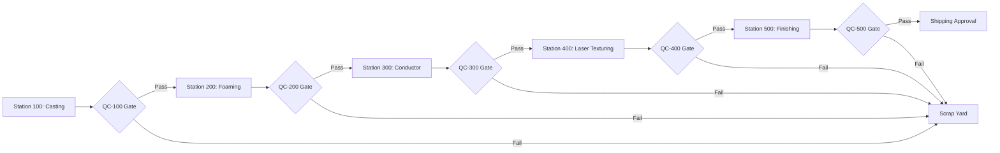

# Specification: Manufacturing Data Flow & Process Diagram

This document contains the prompt-ready specifications and layout guidelines for a text-to-image LLM (e.g., GPT-4o, Midjourney, or DALL-E 3) to generate a high-quality, educational diagram representing the steering wheel manufacturing line and database relationships.

---

## LLM Visual Prompt & Layout Instructions

**Prompt for Image Generator:**
> "Create a clean, modern, and highly legible industrial data-flow infographic designed for software engineers. The background should be a dark-mode theme with a professional navy and slate-gray palette. The layout must display a horizontal 5-stage manufacturing assembly line from left to right. Each station must be represented by a distinct block with an icon.
> Below each station block, draw a connected container listing its telemetry schema (column names and brief descriptions, formatted like a clean table/database view).
> Show decision gates (diamond-shaped check-points) after each station representing Quality Control (QC). Draw logical arrows showing what happens on 'PASS' (moves to the next station) and 'FAIL' (points downwards to a 'Scrap Yard' container at the bottom).
> Highlight how a shared 'part_id' primary key runs through all tables to link them together."

---

## Diagram Content Specifications

### 1. The Global Tracking Tables (Shared Context)

These two tables track the overall state and inputs across the entire factory floor:

*   **`production_log`** (Tracks part lifecycle)
    *   `part_id`: Primary key (Format: `SW-202607-XXXXXXX`).
    *   `start_time`: Timestamp when part started casting.
    *   `end_time`: Timestamp when part finished or was scrapped.
    *   `final_status`: Final state of part (`Pass` or `Scrap`).
    *   `scrap_reason`: Reason for failure (empty if passed).
    *   `material_batch_id`: Link to raw material.
*   **`material_batches`** (Tracks raw materials)
    *   `material_batch_id`: Primary key.
    *   `supplier_name`: Supplier source (e.g., "AluMag Corp").
    *   `raw_magnesium_purity`: Purity level (Normal: `98.5% ± 0.3%`).
    *   `polyol_batch_no` / `iso_batch_no`: Chemical lot identifiers.
    *   `leather_grade`: Grading of finishing leather.

---

### 2. The 5-Station Process Flow & Schemas

---

#### Station 100: Magnesium Skeleton Casting
*   **Physical Process:** Molten magnesium alloy injected into a die mold under high pressure.
*   **Casting Telemetry Schema (`casting_telemetry`):**
    *   `clamp_force`: Die clamping force (Normal: `580 - 620 tons`).
    *   `melt_temp`: Magnesium liquid temp (Normal: `640°C - 680°C`).
    *   `injection_pressure`: Injection piston pressure (Normal: `680 - 740 bar`).
    *   `die_temp`: Temperature of the mold die (Normal: `200°C - 230°C`).
    *   `vacuum_level`: Mold vacuum status (Normal: `30 - 50 mbar`).
*   **Gate QC-100 (Casting Check):**
    *   `porosity_pct`: Checked via automated X-Ray (Must be `< 2.0%`).
    *   `casting_weight`: Scales audit (Must be `950g - 1050g`).

---

#### Station 200: Polyurethane Foaming
*   **Physical Process:** Skeleton loaded into mold; Polyol and Isocyanate mix and expand over the frame.
*   **Foaming Telemetry Schema (`foaming_telemetry`):**
    *   `polyol_temp` / `iso_temp`: Chemical temps (Normal: `22°C - 25°C`).
    *   `polyol_flow_rate` / `iso_flow_rate`: Flow speeds (Normal: `100g/s` / `106g/s`).
    *   `mixing_ratio`: Ratio of Polyol:Iso (Normal: `100:104` to `100:108`).
    *   `mold_temp`: Foam mold core temp (Normal: `45°C - 55°C`).
*   **Gate QC-200 (Foaming Check):**
    *   `foam_hardness_shore_a`: Tactile hardness (Must be `40 - 60 Shore A`).
    *   `foam_weight`: Foamed core weight check (Must be `300g - 350g`).

---

#### Station 300: Conductor & Wiring Assembly
*   **Physical Process:** Resistive heating element wire wrapped around the rim; thermistor sensor embedded.
*   **Conductor Telemetry Schema (`conductor_telemetry`):**
    *   `winding_tension`: Tension of resistive wire wrapper (Normal: `12N - 16N`).
    *   `pressing_force`: Embedding force into polyurethane (Normal: `80N - 100N`).
    *   `crimp_force`: Harness electrical connector crimp load (Normal: `1.2 - 1.5 kN`).
*   **Gate QC-300 (Initial Electrical Check):**
    *   `heater_resistance_ohms`: Core circuit check (Must be `2.1 - 2.5 Ω`).
    *   `thermistor_resistance_kohm`: Sensor sanity check (Must be `9.5 - 10.5 kΩ`).

---

#### Station 400: Laser Surface Texturing
*   **Physical Process:** Robotic arms rotate solid foam rim while a CO2 laser etches micro-grooves for grip.
*   **Laser Telemetry Schema (`laser_telemetry`):**
    *   `laser_power`: Laser beam intensity (Normal: `80W - 120W`).
    *   `laser_scan_speed`: Speed of laser sweeps (Normal: `800 - 1000 mm/s`).
    *   `robot_offset`: Alignment precision check (Normal: `0.0 - 0.15 mm`).
    *   `focal_distance`: Laser optics focus point (Normal: `148 - 152 mm`).
*   **Gate QC-400 (Laser Texture Check):**
    *   `texture_depth_microns`: Laser scan profiling (Must be `80 - 120 μm`).
    *   `surface_roughness_ra`: Optical finish calculation (Must be `6.0 - 10.0 μm`).

---

#### Station 500: Leather Wrapping & Final Assembly
*   **Physical Process:** Leather wrapped, glued, and stitched; switches and airbag module assembled.
*   **Finishing Telemetry Schema (`finishing_telemetry`):**
    *   `wrapping_tension`: Tension pulling leather seams (Normal: `20N - 25N`).
    *   `glue_weight` / `glue_temp`: Adhesive application specs (Normal: `15g - 25g` / `120°C - 140°C`).
    *   `screw_torque`: Bezel and trim fastening load (Normal: `2.4 - 2.8 Nm`).
*   **Gate QC-500 (Final End-Of-Line Check):**
    *   `final_heater_resistance_ohms`: Verifies heater wire did not break (Must be `2.1 - 2.5 Ω`).
    *   `airbag_resistance_ohms`: Airbag loop resistance (Must be `1.8 - 2.2 Ω`).
    *   `switch_continuity_resistance_ohms`: Switch circuit resistance (Must be `< 0.5 Ω`).
    *   `adhesion_peel_force_n`: Glue bond test (Must be `15 - 30 N`).

---

## 3. Transition Logic (Database Updates)

When a steering wheel (`part_id`) moves through the line, the database processes transitions as follows:

| Process Event | Fields Modified / Populated | Resulting Table State |
|---|---|---|
| **Casting Start** | Create new `part_id` in `production_log`. Set `start_time`, set `material_batch_id`. | Part active in line. |
| **Passing a QC Gate** | Write telemetry parameters to `casting_telemetry`, write measurements with `result='PASS'` to `quality_inspections`. | Part progresses to the next station block. |
| **Failing a QC Gate** | Write measurements with `result='FAIL'` to `quality_inspections`. Set `final_status='Scrap'` and `scrap_reason=[failed_parameter]` in `production_log`. Set `end_time` to current time. | Part exits line. **No further telemetry or QC records are written for this part_id** at subsequent stations. |
| **Final QC Pass** | Set `final_status='Pass'` in `production_log`. Set `end_time` to final scan timestamp. | Part leaves factory approved for shipping. |
